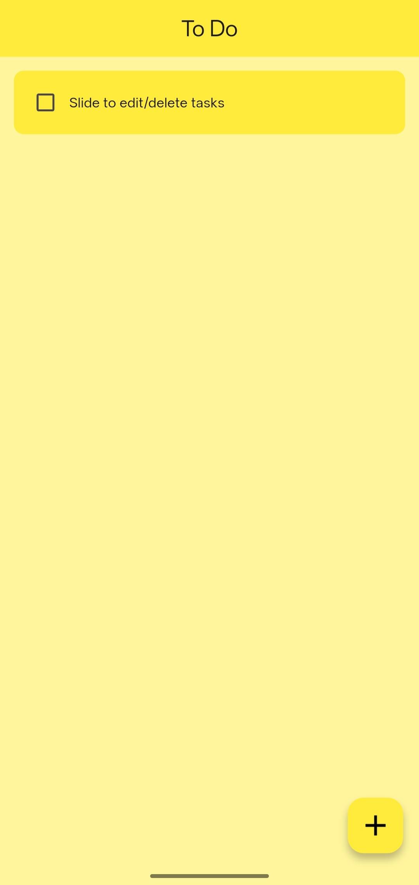
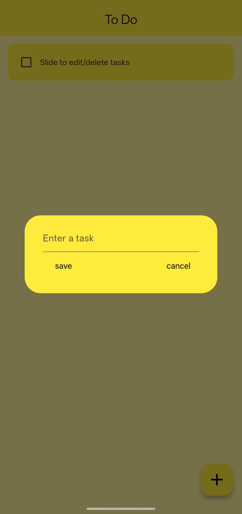
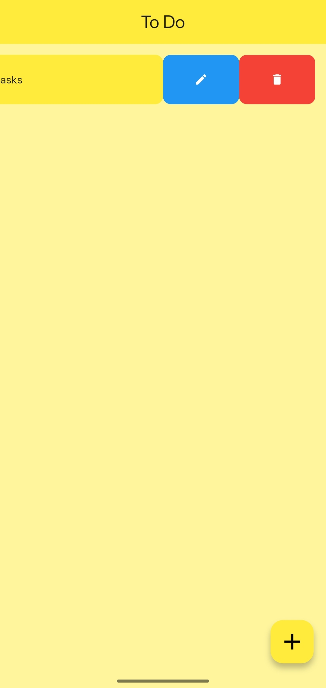

<h1 align="center">📝 Simplist</h1>

  Simplify Tasks • Amplify Productivity • Stay Organized

  
  
  
  
  

---

## 🚀 Overview

**Simplist** is a lightweight, cross-platform task management application built with **Flutter**.  
It provides a clean and minimal interface with persistent local storage powered by **Hive**.

Designed with modular architecture and reusable components for maintainability and scalability.

---

## ✨ Features

- ➕ Add Tasks  
- ✏ Edit Tasks  
- 🗑 Swipe-to-Delete (Slidable)  
- ✅ Mark Tasks as Completed  
- 💾 Local Persistent Storage (Hive)  
- 🟨 Minimal UI Design  
- 📱 Android APK Support  
- 🖥 Windows Desktop Support  

---

## 🛠 Tech Stack

- **Flutter**
- **Dart**
- **Hive (NoSQL Local Database)**
- **flutter_slidable**
- Windows Desktop Support

---

## 📦 Download Builds

### 📱 Android APK
👉 https://github.com/ramanzenith/Simplist-To-Do-app/releases/download/v1.0.0/Simplist.To-Do.App.apk  

### 🖥 Windows Version
👉 https://github.com/ramanzenith/Simplist-To-Do-app/releases/download/v1.0.0/Simplist.To-Do.App.zip  

> Extract the ZIP file and run the `.exe`.

---

## 📂 Project Structure

lib/
├── main.dart
├── pages/
├── widgets/
├── database/

---

## 🧠 Architecture Highlights

- Modular widget-based UI
- Clear separation of UI & data logic
- Persistent storage abstraction via Hive
- Cross-platform build configuration

---

## 📸 Screenshots

---

## 🔮 Future Improvements

- 🌙 Dark Mode
- 📅 Due Dates
- 🔎 Search & Filter
- ☁ Cloud Sync
- 📊 Analytics Dashboard

---

## 📄 License

MIT License © 2026 Ramandeep Singh

